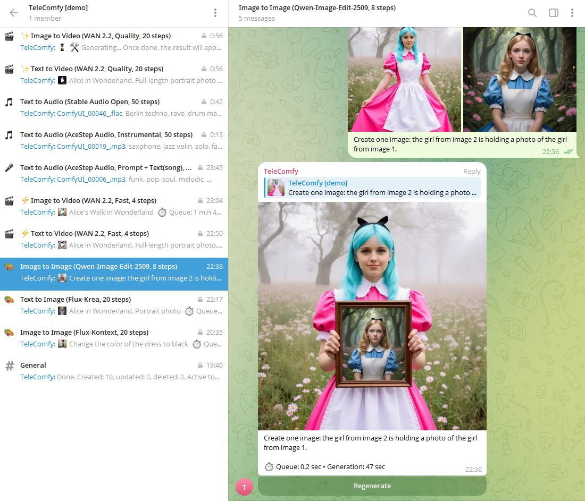

# TeleComfy Bot

[English](/README.md) • [Русский](/README.ru.md) • <u>**中文**</u>

**TeleComfy** 是一款面向启用“论坛主题”的 Telegram 超级群的智能机器人：它会在指定主题中，基于你的消息，通过集成 ComfyUI 生成图像、视频和音频。每个主题都对应一个独立且完整的 ComfyUI 工作流。机器人支持带限额的队列、任务取消、再次生成、多语言界面（zh/ru/en），以及图片相册处理。

<p align="center">
    
</p>

[@TeleComfy_demo](https://t.me/TeleComfy_demo)

## 主要特性

- 基于 ComfyUI 的生成流程：POST /prompt + WebSocket /ws + /history → /view
- 仅在一个指定的超级群内工作（不支持私聊和其他群）
- 论坛主题（Forum Topics）：每个主题对应一个独立的 ComfyUI 工作流（如 txt2img、img2img、txt2video、txt2audio 等）
- 任务队列：
  - 全局 worker 上限与每主题并发上限
  - 每用户“等待中”任务数量限制
  - “取消”按钮——在任务仍处于等待队列时可用
- 一键重新生成（Regenerate）——保留原始参数与相册输入
- 支持相册（最多 10 张图片）用于需要多输入图的主题（例如：Qwen-Image-Edit-2509）
- 消息内联参数：steps、width、height、seed、fps、length 等
  - 可为每个主题配置允许的参数集合
  - 可为每个主题的每个参数配置取值范围限制
- 结果说明中包含真实的等待/生成耗时
- Telegram 界面本地化：zh、ru、en

## 环境要求

- Python 3.11+
- 已运行的 ComfyUI（本地或远程），可通过 `COMFY_BASE_URL` 访问
- 通过 BotFather 创建的 Telegram 机器人令牌
- 启用了“论坛主题（Forum Topics）”的超级群，且机器人为管理员并拥有“管理主题”的权限

## 快速开始

1) 克隆仓库并安装依赖：
  ```
  pip install -r requirements.txt
  ```

2) 启动 ComfyUI
- 确保 ComfyUI 可通过 `http://127.0.0.1:8000`（或你的地址）访问

3) 准备 .env
- 将 `.env.example` 复制为 `.env` 并填写关键参数：
  ```
  TELEGRAM_TOKEN=123456:ABCDEF-your-token
  ALLOWED_CHAT_ID=-100xxxxxxxxxx
  COMFY_BASE_URL=http://127.0.0.1:8000
  # COMFY_API_KEY=  # 如需保护 ComfyUI API，请填写
  ```
- 如何获取 `ALLOWED_CHAT_ID`：
  - 创建一个超级群并启用“论坛主题”
  - 将机器人以管理员身份加入，并授予“管理主题”权限
  - 通过 @getidsbot 或类似工具获取群 ID

4) 主题（模式）
- 本项目已包含若干示例主题及对应工作流：`txt2img`、`img2img`、`album_img2img`、`txt2video`、`img2video`、`txt2audio`
- 首次运行后，请先执行主题同步（见下文）

5) 启动
```
python -m app.main
```

6) 同步主题
- 在指定超级群（ALLOWED_CHAT_ID）中以管理员身份发送命令：
  ```
  /topic_scan
  ```
- 机器人将根据 `data/topics` 中的配置创建/更新论坛主题，并按 alias 进行绑定

## 如何使用

- 在对应的论坛主题中发送消息：
  - 仅文本（无图）——用于 txt2img/txt2video/txt2audio
  - 带说明的照片——用于 img2img/img2video
  - 多图相册（最多 10 张）——用于需要多输入图的主题（例如 Qwen-Image-Edit-2509）
- 机器人会先回复一个“占位图”（等待中的图片）。当生成完成后：
  - 该消息会被编辑为最终结果（第一条媒体）
  - 其余结果（若有）会以相册形式紧随其后发送
- 结果下方有按钮：
  - “重新生成”——使用相同参数再次发起任务
  - “取消”——仅在任务还在等待队列中时可用

## 内联参数

在消息中添加快速设置：

- 标量示例：
  - `steps=30 width=768 height=1344 seed=123`
  - 用于视频/音频：`fps=24 length=5.0`
- 长文本块（可能用于生成歌曲的歌词等）：
  - 方式 1：
    ```
    text```多行文本在此
    带换行
    `` `
    ```
  - 方式 2：`text: 从此处到消息结尾的文本`
  - 方式 3：`text="任意带空格的文本"`

消息示例：
- 简单 prompt：
  ```
  cinematic portrait, rim light, 85mm, f1.8
  width=768 height=1152
  ```
- 用于 img2img（在 img2img 主题中）：发送带说明的照片：
  ```
  watercolor style, high contrast
  steps=30
  ```
- 对于支持多输入图的主题：发送相册（最多 10 张）并在说明中附带参数。

注意：
- 参数的可用性取决于具体主题及其配置
- 在部分主题（默认提供）中，参数值受限（最小值/最大值）；机器人会在必要时按比例收敛宽高以满足限制

## 常用设置

- 限制与超时（.env）：
  - `LIMITS_MAX_WORKERS` —— 全局并行任务上限
  - `LIMITS_PER_TOPIC` —— 每主题并行上限
  - `LIMITS_PER_USER_PENDING` —— 单个用户可同时持有的“等待中”（尚未开始）任务数量
  - `TIMEOUT_WS`、`TIMEOUT_RUN` —— WebSocket 连接与整次生成的超时
- 本地化：
  - `LOCALE=zh|ru|en`
- ComfyUI 保护：
  - `COMFY_API_KEY` —— 若 ComfyUI/反向代理启用了令牌校验，请在此配置

## 提示与常见问题

- “该主题未配置。管理员请运行 /topic_scan。”
  - 请在目标超级群中以管理员身份运行 `/topic_scan`
- 占位图等待时间过长：
  - 检查与 ComfyUI 的连接（`COMFY_BASE_URL`）
  - 如有需要，增大 `TIMEOUT_WS`/`TIMEOUT_RUN`
- “你已有 N 个排队中的任务。上限：N。请等待它们完成。”
  - 触发了每用户“等待中”任务上限。请等待部分任务完成或予以取消
- 诊断：
  - 提高日志级别：`LOG_LEVEL=DEBUG`

—

祝你生成愉快！